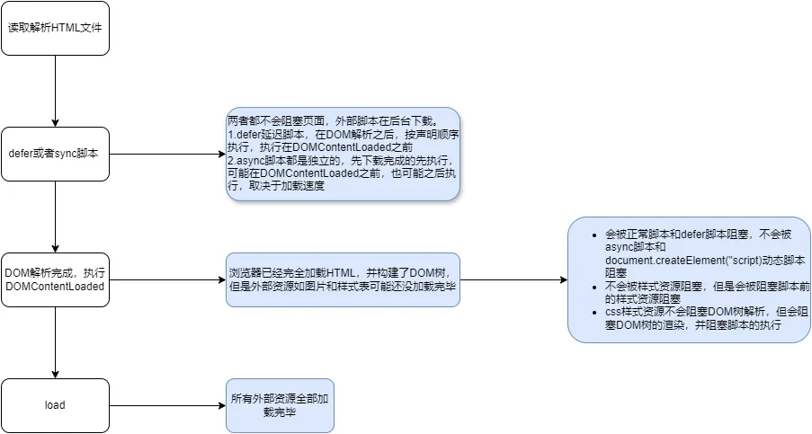

# 浏览器输入URI发生了什么？


# async与defer？document.DOMContentLoaded 与 window.load

* defer与async都在后台下载脚本，不会阻塞解析DOM树
* defer在DOM树构建后按照文档顺序执行脚本，但在DOMContentLoaded生命周期前执行
* async脚本之间都是独立的，按照加载顺序执行，可能在DOMContentLoaded前执行也可能在DOMContentLoaded之后
* DOMContentLoaded在完全加载完HTML文件并将**DOM树**构建后执行，此时一些外部资源如样式表、图片可能还没下载完毕
* 外部样式表资源不会阻塞DOM树解析，会阻塞DOM树的渲染，JS需要等待CSS资源下载完毕才能运行，因为JS可能操作DOM的样式
* 如果外部样式表在defer脚本或者正常脚本之前，DOMContentLoaded也要在外部样式表资源加载后执行，因为脚本可能修改样式
* onload时所有资源全部加载完毕
* [相关资料链接](https://zh.javascript.info/script-async-defer)



# 如何实现防抖？

* 定时器实现

```javascript
    function debounce(fn: Function, deleay: number, isLeading?: boolean) {
        let timer;
        let isFirst = true;
        return function (...arg) {
                    if(isLeading && isFirst){
                        isFirst = false;
                        fn.apply(this,arg);
                    }
                    if(timer){
                        clearTimeout(timer);
                    }
                    timer = setTimeout(()=>{
                               fn.apply(this,arg);
                            }, deleay)
                }
    }
```

* 时间戳实现,默认第一次直接执行

```javascript
    function debounce(fn: Function, deleay: number) {
        let last = 0;
        return function (...arg) {
            const now = new Date().valueOf();
            if(now - last >= deleay){
                fn.apply(this,arg);
            }
            last = now;
        }
    }
```

# 如何实现节流？

```javascript
   function debounce(fn: Function, deleay: number) {
        let last = 0;
        return function (...arg) {
            const now = new Date().valueOf();
            if(now - last >= deleay){
                last = now;
                fn.apply(this,arg);
            }
        }
    }
```

# 实现一个Promise.All？

```javascript
function promisAll(promisList){
    return new Promise((resolve,reject) =>{
        const length = promistList.length;
        if(!Array.isArray(promisList) || length === 0){
            resolve([]);
        }
        let count = 0;
        const results = new Array(length);
        promiseList.forEach((promise,index)=>{
            Promise.resolve(promise).then((res)=>{
                count++;
                results[index] = res;
                if(count === length){
                    resolve(results);
                }
            }).catch((error)=>{
                reject(error);
            })
        })
    })
}
```

# 实现一个深拷贝

## JSON.stringfy

- 方便快捷，但是不能拷贝Regex、Symbol、Date、undefined、function，信息会丢失。 
- 拷贝循环引用对象会报错TypeError: Converting circular structure to JSON
```javascript
const obj = {
              name: 'John',
              age: 30
            }
obj.self = obj;
```

## lodash库的deepCopy

```javascript
const _ = require('lodash');
const clonedObj = _.cloneDeep(originalObj);
```

## 递归遍历

```javascript
function deepCopy(obj){
    if (typeof obj !== 'object' || obj === null) {
        return obj;
    }
    let clone;
    if(Array.isArray(obj)){
        clone = [];
        for(let i = 0; i < obj.length ;i++){
            clone[i] = deepCopy(obj[i])
        }
    } else{
        clone = {}
        // key in obj会遍历原型链上继承的属性
        for(let key in obj){
            // 只会判断属于自身可枚举的属性才会true
            if(obj.hasOwnProperty(key)){
                clone[key] = deepCopy(obj[key])
            }
        }
    }
    return clone;
}
```

# 数组slice、splice、shift、unshift、pop区别

- slice 截取数组，返回一个截取的数组，不会改变原数组，参数为起始索引、结束索引，不包含结束索引
  ```javascript
    const arr = [1,2,3,4];
    const s = arr.slice(1,2); // 参数为起始索引、结束索引，不包含结束索引
    // s = [2]; arr = [1,2,3,4]
  ```
- splice 删除或者插入元素，第一个参数为起始索引，第二个参数为删除的长度，第三个参数为插入的元素，会改变原数组
  ```js
    const arr = [1,2,3,4];
    arr.splice(2,0,5); // 在索引2插入元素5 => [1,2,5,3,4]
  ```
- shfit 删除原数组第一个元素，返回删除的元素
 ```js
    const arr = [1,2,3,4];
    arr.shfit(); // 1
    // arr 为 [2,3,4]
  ```
- unshift 数组开头插入元素，返回数组的长度
   ```js
    const arr = [1,2,3,4];
    arr.unshift(5,6,7); // 长度为7
    // arr 为 [5,6,7,1,2,3,4]
  ```
- pop 删除数组最后一个元素，返回最后一个元素

# 浏览器重排与回流

- 重排意味着几何变化，性能影响大
- 回流意味着样式变化，性能影响小
- 使用transform实现动画，不会引起重排，浏览器会单独生成新的渲染层，不影响原有布局，并进行GPU加速，只发生回流

# 301、302、304、强缓存、协商缓存

# React18新特性

# React19新特性

# 如何搭建一个组件库？

# sonar、sentry的使用？

# 内存泄漏如何分析？

# 微前端qiankun与monorepo？